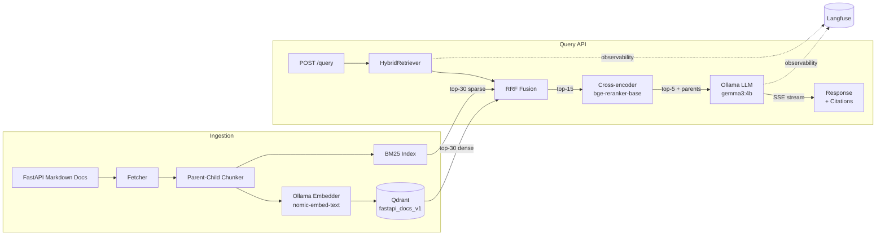

# fastapi-rag-lab

> **Production-grade RAG reference implementation over FastAPI documentation.**
> Hybrid retrieval (dense + BM25 + cross-encoder rerank), SSE streaming with
> citations, full Langfuse observability, hand-written orchestration without
> LangChain.

[](https://github.com/egtimer/fastapi-rag-lab/actions)
[](https://www.python.org/downloads/)
[](#testing)
[](LICENSE)

I built this to test chunking strategies, hybrid retrieval, and hallucination
evaluation against a corpus I actually know well. Most RAG tutorials stop at
"it works on my demo query". This one measures whether it works on 100
questions and tells you honestly when it doesn't.

Everything runs locally: Ollama for embeddings and generation, Qdrant for
vector storage, Langfuse for traces. No API keys, no vendor lock-in. If you
have Docker and Ollama, you can reproduce every number in the benchmarks.

## Roadmap

- ✅ **Phase 1** — Project scaffold, CI, smoke tests, [ADR-001](docs/decisions/001-chunking-strategy.md)
- ✅ **Phase 2** — Ingestion pipeline (154 markdown docs → 2054 chunks indexed in Qdrant), [ADR-002](docs/decisions/002-ingestion-pipeline.md)
- ✅ **Phase 3** — Hybrid retrieval (dense + BM25 + RRF + bge-reranker-base), [ADR-003](docs/decisions/003-hybrid-retrieval.md)
- ✅ **Phase 4** — `/query` API with SSE streaming, citations, Langfuse tracing per query, [ADR-004](docs/decisions/004-query-api-streaming.md)
- 🚧 **Phase 5.1** — RAGAS eval pipeline + golden dataset + custom citation accuracy metric (in progress)
- 📋 **Phase 5.2** — Benchmarks executed + comparative analysis + repo polish

Latest: Phase 4 shipped Apr 15, 2026 ([commits](https://github.com/egtimer/fastapi-rag-lab/commits/main)).

## Why this project exists

I've been building production RAG systems for clients over the last year, and
most of what I've learned does not fit in a tutorial. The interesting problems
are in the parts nobody writes blog posts about:

- Chunking that preserves semantic boundaries without losing context.
- Measuring retrieval quality before measuring generation quality.
- Knowing when a bad answer is the retriever's fault, the chunker's fault,
  or the model's fault.
- Catching hallucinations before they reach the user.

This repository is where I work those problems out on public data, so I can
talk about them openly.

## Engineering principles

Decisions deliberately taken in this repo, with rationale linked when they
warrant an ADR:

- **No LangChain, no LlamaIndex.** Orchestration is hand-written for control
  over failure modes. LangChain abstractions become liabilities in production
  when something fails — debugging a 5-level chain of polymorphic abstractions
  is brutal. See [ADR-003](docs/decisions/003-hybrid-retrieval.md).
- **No mocked tests.** Integration tests run against real Ollama + real Qdrant
  via docker-compose. Mocks give false confidence: tests pass but the system
  fails in production because the mock did not reflect real behaviour.
- **Observability from day one.** Langfuse traces every query (retrieval span +
  generation span + total latency). You cannot optimise what you cannot measure.
- **ADRs for every significant decision.** Future-me (and reviewers) need to
  understand the why, not just the what. See [`docs/decisions/`](docs/decisions/).
- **Honest about limitations.** See [Known limitations](#known-limitations) below.

## Architecture



## Stack

- Python 3.12+
- FastAPI + Pydantic v2
- Qdrant (self-hosted via Docker)
- Ollama on the host: `nomic-embed-text` (embeddings), `gemma3:4b` (generation)
- `rank_bm25` for sparse retrieval
- `sentence-transformers` for cross-encoder reranking (`BAAI/bge-reranker-base`)
- Langfuse (self-hosted via Docker) for observability
- RAGAS for evaluation metrics (Phase 5.1)
- `uv` for dependency management
- `pytest` integration tests against real services
- GitHub Actions CI

## Running it locally

### Prerequisites

1. Docker and Docker Compose (for Qdrant and Langfuse)
2. [Ollama](https://ollama.com/) running on the host with required models pulled:
```bash
   ollama pull nomic-embed-text
   ollama pull gemma3:4b
```
3. Python 3.12+ with [uv](https://docs.astral.sh/uv/)

### Start services

```bash
docker compose up -d
uv sync
```

### Running ingestion

The ingestion pipeline clones the FastAPI docs at a pinned commit, chunks them
using a heading-aware parent-child strategy, embeds children via Ollama, and
upserts everything into Qdrant.

```bash
# If Ollama is on the Windows host (WSL setup), set the gateway IP:
export OLLAMA_HOST=http://$(cat /proc/net/route | awk '/00000000.*00000000/ {print $3}' | head -1 | sed 's/../0x&\n/g' | tac | xargs printf "%d.%d.%d.%d\n"):11434

# Or if Ollama is running locally:
export OLLAMA_HOST=http://localhost:11434

# Langfuse credentials (matches docker-compose.yml defaults):
export LANGFUSE_PUBLIC_KEY=pk-lf-local-dev
export LANGFUSE_SECRET_KEY=sk-lf-local-dev
export LANGFUSE_HOST=http://localhost:3000

python -m fastapi_rag_lab.ingest
```

After a successful run:
- `data/raw/manifest.json` contains ingestion metadata (file counts, timestamps)
- Qdrant dashboard at http://localhost:6333/dashboard shows the `fastapi_docs_v1` collection
- Langfuse at http://localhost:3000 shows the `ingest_run` trace with per-stage spans

### Hybrid retrieval (programmatic)

```python
from fastapi_rag_lab.retrieval.hybrid import HybridRetriever

retriever = HybridRetriever()
results = retriever.retrieve("How do I handle background tasks in FastAPI?")
for r in results:
    print(f"{r.rerank_score:.3f} | {r.chunk_text[:80]}...")
```

See [ADR-003](docs/decisions/003-hybrid-retrieval.md) for the design rationale
(why RRF over score normalisation, why bge-reranker-base, why hybrid over pure
dense).

### Query API

Start the server:

```bash
export OLLAMA_HOST=http://$(cat /proc/net/route | awk '/00000000.*00000000/ {print $3}' | head -1 | sed 's/../0x&\n/g' | tac | xargs printf "%d.%d.%d.%d\n"):11434
uv run uvicorn fastapi_rag_lab.api.app:app --reload --port 8000
```

`POST /query` runs hybrid retrieval, builds a prompt with the top-K parent
chunks as context, and streams the LLM response token-by-token via SSE.
Citations (source chunks used) arrive as the final event before the stream
closes.

```bash
curl -N -X POST http://localhost:8000/query \
  -H "Content-Type: application/json" \
  -d '{"query": "How do I handle exceptions in FastAPI?", "top_k": 5}'
```

For a non-streaming JSON response:

```bash
curl -X POST http://localhost:8000/query \
  -H "Content-Type: application/json" \
  -d '{"query": "How do I handle exceptions in FastAPI?", "top_k": 5, "stream": false}'
```

See [ADR-004](docs/decisions/004-query-api-streaming.md) for why SSE over
WebSockets, why streaming-first, and how Langfuse tracing is structured.

## Testing

38 integration tests covering ingestion, retrieval, and the query API. All
tests run against real Ollama and Qdrant — no mocks.

```bash
export OLLAMA_HOST=http://localhost:11434  # or your WSL gateway IP
uv run pytest tests/ -v
```

## Design decisions

Significant architectural choices are documented in
[`docs/decisions/`](docs/decisions/):

- [001 — Chunking strategy](docs/decisions/001-chunking-strategy.md): why parent-child, why heading-aware
- [002 — Ingestion pipeline](docs/decisions/002-ingestion-pipeline.md): pipeline shape, manifest tracking
- [003 — Hybrid retrieval](docs/decisions/003-hybrid-retrieval.md): RRF, reranker choice, no-LangChain rationale
- [004 — Query API streaming](docs/decisions/004-query-api-streaming.md): SSE vs WebSockets, citation format, Langfuse spans

## Known limitations

This section will grow as the project does. Things I already know will be
limitations:

- The gold dataset will be hand-built and small (target: 80-120 queries).
  Statistical claims will be limited accordingly.
- Running everything locally on a single machine means latency numbers
  depend heavily on hardware. I'll document the machine used for benchmarks.
- `gemma3:4b` is a small model. A larger model would likely improve
  generation quality but the point here is reproducibility, not peak
  accuracy.
- No multilingual support. FastAPI docs are English, the retriever is
  English-only.
- Ingestion re-processes everything on each run. For a corpus this size
  that's fine (a few minutes). Incremental re-ingestion is not worth the
  complexity yet.
- `tiktoken` cl100k_base is a proxy for nomic-embed-text's actual tokenizer.
  Close enough for chunk sizing, but token counts in the manifest are
  approximate.
- Heading-based parent segmentation can produce unbalanced parents. Some
  FastAPI doc sections are much longer than 1024 tokens and get accepted
  as oversized rather than split mid-paragraph.

## License

MIT. See [LICENSE](LICENSE).
